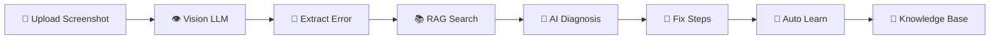

# <div align="center">


<br>


<br><br>

### 🚀 Turn Error Screenshots into Instant Solutions

*Upload any screenshot → Extract error text → Search knowledge base → Generate fixes → Learn automatically*

---

</div>

# 🌟 Overview

Developers spend valuable time manually typing and searching error messages.

**Screenshot Error Diagnoser** eliminates that process using:

✅ Vision AI to read screenshots

✅ RAG for intelligent error matching

✅ AI-generated troubleshooting steps

✅ Auto-learning knowledge base

✅ Cost and token tracking

✅ Beginner-friendly explanations

---

# 🎬 Demo Workflow



---

# ✨ Features

| Feature              | Description                      |
| -------------------- | -------------------------------- |
| 📸 Screenshot Upload | Drag & Drop error screenshots    |
| 👁️ Vision LLM       | Reads error text automatically   |
| 🧠 RAG Engine        | Matches similar known errors     |
| 🤖 AI Diagnosis      | Generates detailed solutions     |
| 🔄 Auto Learning     | Expands knowledge base over time |
| 📚 History Tracking  | Stores previous diagnoses        |
| 💰 Cost Monitoring   | Tracks token usage               |
| 🎯 Beginner Friendly | Simple explanations              |
| 📋 Copy Solution     | One-click copy                   |
| 🎨 Modern UI         | Glassmorphism design             |

---

# 🏗️ Architecture

```text
┌─────────────────────┐
│  Screenshot Upload  │
└──────────┬──────────┘
           │
           ▼
┌─────────────────────┐
│    Vision Model     │
│ Error Extraction    │
└──────────┬──────────┘
           │
           ▼
┌─────────────────────┐
│     RAG Search      │
│ Knowledge Matching  │
└──────────┬──────────┘
           │
           ▼
┌─────────────────────┐
│  AI Solution Agent  │
│ Generate Fix Steps  │
└──────────┬──────────┘
           │
           ▼
┌─────────────────────┐
│   Auto Learning     │
└─────────────────────┘
```

---

# 🧠 AI Agent Workflow

```text
Agent Loop

1️⃣ Observe Screenshot
      ↓
2️⃣ Extract Error
      ↓
3️⃣ Search Knowledge Base
      ↓
4️⃣ Generate Diagnosis
      ↓
5️⃣ Recommend Fixes
      ↓
6️⃣ Store New Knowledge
```

---

# 🛠️ Tech Stack

### Backend

* Python 3.11+
* Flask 3.0

### AI

* OpenRouter API
* Gemini Models
* Llama Models

### RAG

* JSON Knowledge Base
* Similarity Matching

### Frontend

* HTML5
* CSS3
* JavaScript

---

# 📂 Project Structure

```bash
06-screenshot-error-diagnoser
│
├── app.py
│
├── templates
│   └── index.html
│
├── static
│   ├── style.css
│   └── script.js
│
├── tests
│   └── test_app.py
│
├── sample_data
│   └── sample_error.png
│
├── knowledge_base.json
│
├── requirements.txt
│
└── README.md
```

---

# 🚀 Installation

## Clone Repository

```bash
git clone https://github.com/vishnu-psvpec/06-screenshot-error-diagnoser.git

cd 06-screenshot-error-diagnoser
```

## Create Virtual Environment

```bash
python -m venv venv
```

Windows

```bash
venv\Scripts\activate
```

Linux / Mac

```bash
source venv/bin/activate
```

---

## Install Dependencies

```bash
pip install -r requirements.txt
```

---

## Configure Environment

Create `.env`

```env
OPENROUTER_API_KEY=your_api_key

OPENROUTER_MODEL=openrouter/free

OPENROUTER_API_URL=https://openrouter.ai/api/v1
```

---

## Run Application

```bash
python app.py
```

Application runs on:

```text
http://localhost:5001
```

---

# 🎯 Example Diagnoses

## 🐍 Python Error

Input:

```text
ModuleNotFoundError:
No module named flask
```

Output:

```text
1. Install Flask

pip install flask

2. Verify Installation

pip list

3. Activate Virtual Environment

4. Add Flask to requirements.txt
```

---

## 🔌 Port Already In Use

Input

```text
EADDRINUSE
address already in use
```

Output

```text
1. Find process using port

lsof -i :5000

2. Kill process

kill -9 PID

3. Restart application
```

---

## 🎨 Adobe Error 16

Output

```text
1. Close Adobe Applications

2. Restart Computer

3. Run Adobe Cleaner Tool

4. Reinstall Software
```

---

# 📊 Evaluation Mapping

| Requirement          | Status |
| -------------------- | ------ |
| AI Agent             | ✅      |
| RAG                  | ✅      |
| API Integration      | ✅      |
| End-to-End Execution | ✅      |
| Knowledge Base       | ✅      |
| Auto Learning        | ✅      |
| Testing              | ✅      |

---

# 🧪 Unit Tests

Run:

```bash
pytest tests/ -v
```

Expected:

```text
✅ test_rag_finds_module_error

✅ test_rag_finds_econnrefused

✅ test_rag_returns_empty

✅ test_knowledge_base

✅ test_index_returns_200
```

---

# 📈 Future Enhancements

* 🔍 OCR fallback engine
* 🧠 Local LLM support
* ☁️ Cloud deployment
* 📱 Mobile application
* 📊 Analytics dashboard
* 🗂️ Vector database support
* 🎙️ Voice explanation mode

---

# 🤝 Contributing

Contributions are welcome.

```bash
Fork → Create Branch → Commit → Push → Pull Request
```

---

# 📜 License

MIT License

Free to use, modify and distribute.

---

# 💙 Built With

### Python • Flask • OpenRouter • RAG • AI Agents


</div>
